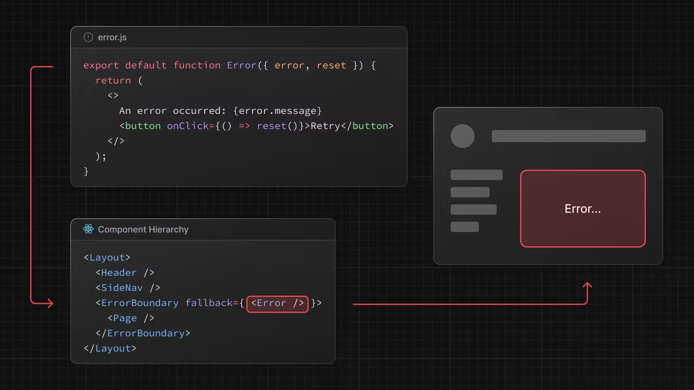

# Error Handling

- file convention - `error.js`
- Auto wraps a route segments and its nested children in a React-Error-Boundary
- Create error UI
- Isolate errors to effected segments while keeping the rest of the application functional.
- Add functinality to attempt to recover from an error without a full page reload.

```
'use client' // Error components must be Client Components
 
import { useEffect } from 'react'
 
export default function Error({ error, reset }) {
  useEffect(() => {
    // Log the error to an error reporting service
    console.error(error)
  }, [error])
 
  return (
    <div>
      <h2>Something went wrong!</h2>
      <button
        onClick={
          // Attempt to recover by trying to re-render the segment
          () => reset()
        }
      >
        Try again
      </button>
    </div>
  )
}
```

# How error.js works



- `error.js` automatically creates a `React Error Boundary` that wraps a nested child segment or page.js component.
- `error.js` used as a `fallback` component
- If an error is thrown within the error boundary, the error is contained and the fallback component is rendered.
- When the fallback error component is active, layout above the error boundary maintain their state and remain interactive.
- Nearest Error

# Recovering from errors

An error component can use the `reset()` function to prompt the user to attempt to recover from the error. When Executed the function try to re-render the Error boundary's contents. If successful, the fallback error component is replaced with the result of the re-render. 

```
'use client'
 
export default function Error({ error, reset }) {
  return (
    <div>
      <h2>Something went wrong!</h2>
      <button onClick={() => reset()}>Try again</button>
    </div>
  )
}

```

# Handling Errors in Layouts

- `error.js` boundaries do not catch errors thrown in `layout.js` or `template.js` components of the same segment. 
- To handle errors within a specific layout or template, palce an `error.js` file in the layout's parent segment.
- To handle errors within the root layout or template, use a variation of `error.js` called `global-error.js`.
- `global-error.js` error boundary wraps the entire application and its fallback component replacews the root layout when active. Because of this, it is important to note that `global-error.js` must define it's own `<html>` and `<body>` tags.